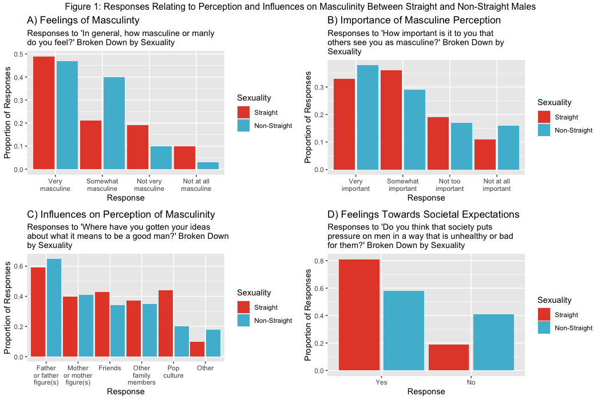
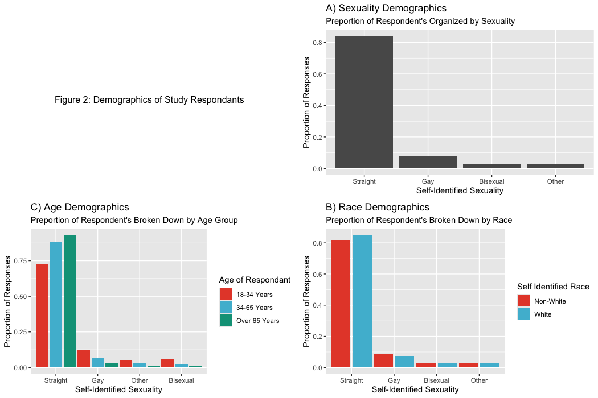

```{r setup, include=FALSE}
knitr::opts_chunk$set(echo = TRUE)
library(dplyr)
library(tidyverse)
library(ggplot2)
library(tidyr)
library(lattice)
library(grid)
library(fivethirtyeight)
library(gridExtra)
library(ggsci)
```

## [**Background**]{.underline}

Gender roles have greatly shaped the world around us, but in recent years we as a society have begun to look at these through a more critical lense. The feminist movments of the 19th and 20th centuries produced a shift in perspective on what is expected of individuals as it pertains to their gender assigned at birth (3). Masculinity is specifically defined by the traits traditionally assigned to men and boys (2). While these specific masculine traits ary across socities those used most broadly used to define the term are those used in western (European and American) culture. These traits include but are not limited to (4):

-   Showing or communicating little emotion

-   Possession of power, strength, and/or control

-   Competitive nature and engagement in aligned activities like sports

-   A higher degree of aggression and likelihood of violence

However, what it means to be man seems to extend beyond these characteristicts. Many men do not feel they entirely align will **all** traits associated with masculinity, sometimes resulting in significant social and mental difficulties (4). This makes understanding the origin and impact of these expectations vital to promoting a healthier form of masculinity in society.

There has been extensive work done exploring the psychological and social impacts these gender based expectations have on men. This mini-project looks at some of this data collected by ABC's FiveThirtyEight (1), specifically evaluating if there are any differences in the influencers and preception of masculine identity between men who identify sexually as straight versus those who do not.

## [**Analysis**]{.underline}

### Perceptions of Masculinity

```{r include=FALSE}
#tidying masculinity_survey to view only few questions of interest for straight and non-straight groups.
pressure <- masculinity_survey |>
  filter(question == 'Do you think that society puts pressure on men in a way that is unhealthy or bad for them?')|>
  select(c(question, response, straight_no, straight_yes))|>
  pivot_longer(cols = c(straight_no, straight_yes), names_to = "sexuality", values_to = "p_proportion")|> 
  group_by(sexuality)

outward_perception <- masculinity_survey|>
  filter(question == 'How important is it to you that others see you as masculine?')|>
  select(c(question, response, straight_no, straight_yes))|>
  pivot_longer(cols = c(straight_no, straight_yes), names_to = "sexuality", values_to = "op_proportion")|> 
  group_by(sexuality)

masculine_feelings <- masculinity_survey |>
  filter(question == 'In general, how masculine or "manly" do you feel?') |>
  select(c(question,response,straight_no, straight_yes))|>
  pivot_longer(cols = c(straight_no, straight_yes), names_to = "sexuality", values_to = "mf_proportion")|> 
  group_by(sexuality)

masculine_influence <- masculinity_survey |>
  filter(question == 'Where have you gotten your ideas about what it means to be a good man? (Select all that apply.)') |>
  select(c(question, response, straight_no, straight_yes))|>
  pivot_longer(cols = c(straight_no, straight_yes), names_to = "sexuality", values_to = "mi_proportion")|> 
  group_by(sexuality)
```

```{r echo=TRUE}
# creating plots based on the selected questions
pressure_plot <- ggplot(data = filter(pressure, response != "No answer"),
  mapping = aes(x = reorder(response, - p_proportion), 
                y = p_proportion, 
                fill = sexuality)) +
  geom_col(position = position_dodge(width = 1))+
  labs(
    title = "D) Feelings Towards Societal Expectations",
    subtitle = str_wrap("Responses to 'Do you think that society puts pressure on men in a way that is unhealthy or bad for them?' Broken Down by Sexuality", 50),
    x = 'Response',
    y = "Proportion of Responses",
    fill='Sexuality') +
  scale_x_discrete(labels = str_wrap(c("Yes", "No"), 10))

outward_perception_plot <- ggplot(data = filter(outward_perception,
                                                response != "No answer"),
  mapping = aes(x = reorder(response, - op_proportion), 
                y = op_proportion, 
                fill = sexuality)) +
  geom_col(position = position_dodge(width = 1))+
  labs(
    title = "B) Importance of Masculine Perception",
    subtitle = str_wrap("Responses to 'How important is it to you that others see you as masculine?' Broken Down by Sexuality", 50),
    x = 'Response',
    y = "Proportion of Responses",
    fill='Sexuality') +
  scale_x_discrete(labels = str_wrap(c("Very important", "Somewhat important", "Not too important", "Not at all important"), 10))

masculine_feelings_plot <- ggplot(data = filter(masculine_feelings,
                                                response != "No answer"),
  mapping = aes(x = reorder(response, - mf_proportion), 
                y = mf_proportion, 
                fill = sexuality)) +
  geom_col(position = position_dodge(width = 1))+
  labs(
    title = "A) Feelings of Masculinty",
    subtitle = str_wrap("Responses to 'In general, how masculine or manly do you feel?' Broken Down by Sexuality", 50),
    x = 'Response',
    y = "Proportion of Responses",
    fill='Sexuality')+
  scale_x_discrete(labels = str_wrap(c("Very masculine", "Somewhat masculine", "Not very masculine", "Not at all masculine"), 10))

masculine_influence_plot <- ggplot(data = filter(masculine_influence,
                                                response != "No answer"),
  mapping = aes(x = reorder(response, - mi_proportion), 
                y = mi_proportion, 
                fill = sexuality)) +
  geom_col(position = position_dodge(width = 1))+
  labs(
    title = "C) Influences on Perception of Masculinity",
    subtitle = str_wrap("Responses to 'Where have you gotten your ideas about what it means to be a good man?' Broken Down by Sexuality", 50),
    x = 'Response',
    y = "Proportion of Responses",
    fill='Sexuality') +
  scale_x_discrete(labels = str_wrap(c("Father or father figure(s)", "Mother or mother figure(s)", "Friends", "Other family members", "Pop culture", "Other"), 10))

```

```{r echo=TRUE}
#creating a grouped figure

title_text_1 <- textGrob("Figure 1: Responses Relating to Perception and Influences on Masculinity Between Straight and Non-Straight Males")

pressure_plot_npg <- pressure_plot + scale_fill_npg(labels = c ('Straight', 'Non-Straight'))

outward_perception_plot_npg <- outward_perception_plot + scale_fill_npg(labels = c ('Straight', 'Non-Straight'))

masculine_feelings_plot_npg <- masculine_feelings_plot + scale_fill_npg(labels = c ('Straight', 'Non-Straight'))

masculine_influence_plot_npg <- masculine_influence_plot + scale_fill_npg(labels = c ('Straight', 'Non-Straight'))

figure1 <- arrangeGrob(top = title_text_1, masculine_feelings_plot_npg, outward_perception_plot_npg, masculine_influence_plot_npg, pressure_plot_npg)

#exported and inserted as png for formatting purposes

```



Overall most respondents, both straight and non-straight, identified as either very or somewhat masculine. Non-straight individuals had a higher proportion of people responding as somewhat masculine and a lower proportion responding as not at all masculine when compared to their straight counterparts. When asked about the importance of being seen as masculine, by others non-straight individuals showed a higher proportion on the more extreme ends (Very Important and Not at All Important) of the response options available. Straight individuals showed higher proportion of responses within the more neutral (Somewhat Important and Not too Important).

Between both sexual groups, father figures were the most predominant influence of masculine identity. In asking where their ideas of masculinity originated, a higher proportion non-straight individuals indicated a parental influence (Maternal or Paternal figures) being a contributor to this. Meanwhile a higher proportion of straight respondents indicated these influences coming from a wider array of sources (friends, other family members, and pop culture). It is important to note that a greater proportion of non-straight individuals indicated other influences beyond what is covered in the standard survey responses influenced their perception of masculinity.

These influences appear to have a significant impact on the men surveyed with the majority agreeing that the pressure placed on men by society has an unhealthy or negative impact. When broken down by sexuality however a larger proportion of non-straight respondents actually disagreed with with this versus their straight counterparts.

### Study Demographics

```{r include=FALSE}
#tidying masculinity_survey to view only responses to specific questions regarding demographics
surv_sex_demographics <- masculinity_survey |>
  filter(question == 'Would you describe your sexual orientation as:') |>
  select(-c(question,age_18_34, age_35_64, age_65_over, white_yes, white_no, children_yes,
            children_no, straight_no, straight_yes))

surv_age_demographics <- masculinity_survey |>
  filter(question == 'Would you describe your sexual orientation as:') |>
  select(-c(question, white_yes, white_no, children_yes,
            children_no, overall, straight_no, straight_yes))

surv_race_demographics <- masculinity_survey |>
  filter(question == 'Would you describe your sexual orientation as:') |>
  select(-c(question, age_18_34, age_35_64, age_65_over, children_yes, children_no, overall, straight_no, straight_yes))

```

```{r echo=TRUE}
#creating demographic plots
sex_plot <- ggplot(
  data = filter(surv_sex_demographics, response != "No answer"),
  aes(x = reorder(response, -overall), y = overall)) +
  geom_col()+ 
  labs(
    title = "A) Sexuality Demographics",
    subtitle = "Preportion of Respondent's Organized by Sexuality",
    x = 'Self-Identified Sexuality',
    y = "Proportion of Responses") 

race_dem_for_plot <- surv_race_demographics|>
  pivot_longer(cols = c(white_yes,white_no), 
               names_to = "race_desig", 
               values_to = "preport_resp_race")|>
  filter(response != "No answer") |>
  group_by(race_desig)

race_plot <- 
  ggplot(data = race_dem_for_plot,
  mapping = aes(x = reorder(response, -preport_resp_race), 
                y = preport_resp_race, 
                fill = race_desig)) +
  geom_col(position = position_dodge(width = 1))+
  labs(
    title = "C) Race Demographics",
    subtitle = "Preportion of Respondent's Broken Down by Race",
    x = 'Self-Identified Sexuality',
    y = "Proportion of Responses",
    fill='Self Identified Race') 
age_dem_for_plot <- surv_age_demographics|>
  pivot_longer(cols = c(age_18_34:age_65_over), 
               names_to = "age_desig", 
               values_to = "preport_resp_age")|>
  filter(response != "No answer") |>
  group_by(age_desig)

age_plot <- 
  ggplot(data = age_dem_for_plot,
  mapping = aes(x = reorder(response, -preport_resp_age), 
                y = preport_resp_age, 
                fill = age_desig)) +
  geom_col(position = position_dodge(width = 1)) +
  labs(
    title = "B) Age Demographics",
    subtitle = "Preportion of Respondent's Broken Down by Age Group",
    x = 'Self-Identified Sexuality',
    y = "Proportion of Responses",
    fill='Age of Respondant'
    )
```

```{r echo=TRUE}
#creating a grouped figure with shared theme
title_text_2 <- textGrob("Figure 2: Demographics of Study Respondants")

age_plot_npg <- age_plot + scale_fill_npg(labels = c ('18-34 Years', '34-65 Years','Over 65 Years'))

sex_plot_npg <- sex_plot + scale_fill_npg()

race_plot_npg <- race_plot + scale_fill_npg(labels = c('Non-White', 'White'))

figure2 <- arrangeGrob(title_text_2, sex_plot_npg, age_plot_npg, race_plot_npg)

#exported and inserted as png for formatting purposes
```



Out of the 1600 men surveyed the vast majority self-identified as straight (Fig 2A). Among straight individuals the white men (Fig 2C) and men over 65 years (Fig 2B) had made up the largest proportion of the subgroup. Exclusively gay, bisexual, and individuals who identified as other however generally had a higher proportion of 18 to 34 year olds as compared to other age groups (Fig 2B). Racially exclusively gay men surveyed had a slightly higher proportion of non-white respondents. There was not enough survey data to see a clear difference between non-white and white individuals in bisexual and other sexual minority groups (Fig 2C).

## [**Discussion**]{.underline}

From the questions analyzed, straight men and men belonging to a sexual minority group appear to have overall similar perceptions of their own masculinity. Both groups showed a majority of respondents indicating they identified as very or somewhat masculine with this perception of this identity by others as very or somewhat important.

There are some nuanced differences between the groups in the importance of outward perception of their masculinity, however, with non-straight showing a higher proportion of responses on opposite ends of survey responses (Very versus not at all important). Straight men however had a higher proportion of responses to this fall in more neutral categories like somewhat or not too important. Why this difference is present may serve as an interesting avenue for future study.

When discussing the influences on their sense of masculinity, the largest proportion of respondents in both non-straight and straight men indicated that paternal figures had a significant impact on this development. Men who are sexual minorities however seemed to have a higher degree of influences from parental figures (either maternal or paternal) while straight men indicated a wider range of masculine influencers. Straight men specifically had a notable increase from non-straight men in how pop culture has influenced their sense of masculine identity.

The impact of these influences was also made clear in this data with both straight and non-straight men indicating that they believed pressures placed on men negatively impact their well-being. However, a higher proportion of surveyed men who belong to sexual minority groups indicated that they did not agree with this than their straight counterparts. Moving forward studies may aim to focus on which pressures specifically pose issues not only to men generally, but which ones are most pressing between straight and sexual minority groups.

Although interesting trends were introduced by the data presented, there are significant limitations to it as well. Overwhelmingly the respondents to this study were straight. Comprehensive study of these initial trends would require a more diverse array of respondents. Limited surveying of gay, bisexual, and other men belonging to sexual minority groups prevents accurate conclusions from being drawn from this study. Within these sexual identities there may also be bias in response based on age and/or race with majority of straight respondents being older white men while a higher proportion of sexual minority respondents were non-white 18 to 34 year olds. These factors may also play a significant role in masculine identity development and perception.

*Citations:*

(1) Ellawinthrop. (2018, June 20). *What do men think it means to be a man?*. FiveThirtyEight. <https://fivethirtyeight.com/features/what-do-men-think-it-means-to-be-a-man/>

(2) *Masculinity*. UNGEI. (n.d.). <https://www.ungei.org/gender-transformative-education-glossary/gender/masculinity>

(3) *Theory in a Digital age: Feminism and the destruction of gender roles*. Theory in a Digital Age: A Project of English 483 Students, Coastal Carolina University. (n.d.). <https://scalar.usc.edu/works/index-2/feminism-and-the-destruction-of-gender-roles>

(4) The Trustees of Princeton University. (n.d.). *Healthy masculinity \| UMatter*. Princeton University. <https://umatter.princeton.edu/respect-matters/healthy-masculinity>
